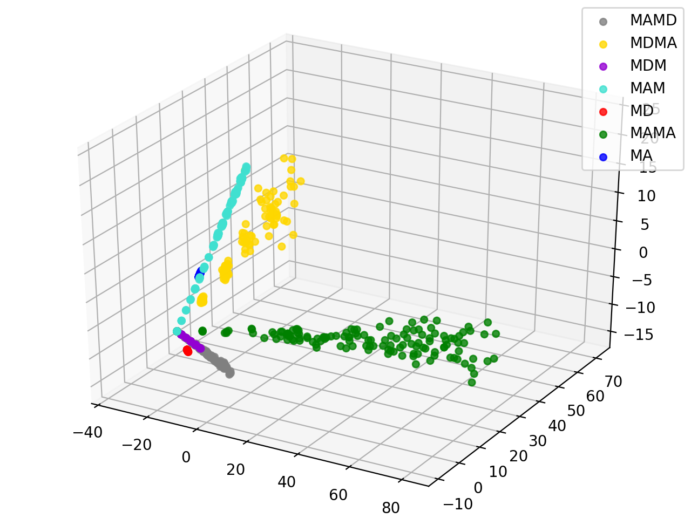

# GraphMSE Code Instructions

The package includes all scripts except parameter analysis corresponding to the extensive experiments in our paper: **GraphMSE: Efficient Meta-path Selection in Semantically Aligned Feature Space for Graph Neural Networks.**

We highly recommend that you run our scripts to test its efficiency and high-performance. The model is quite simple, with few dependencies and GPU Memory requirements. On three datasets provided, you only need a GPU with 4GB RAM.

The model settings and hyperparameters in scripts are exactly the same as corresponding experiment settings in our paper. We conduct all experiments with Python 3.7 and Pytorch 1.5.1, while other versions of Python or Pytorch may be applicable.

For each experiment, we write separate scripts which start with "run_". Thus, reproducing our experiment results becomes very convenient. Here are instructions:

## Node Classification

Directly excute the run_node_class_[dataset].py with python interpreter. For example, on IMDB, you may execute:

```python
python run_nodeclass_imdb.py
```

The default proportion of training set nodes is 20%. You can choose other proportion (40, 60, 80) by simply adding an argument:

```python
python run_nodeclass_imdb.py 40
```

The script will report accuracy as well as attention weights on your screen and write the accuracy in the folder *result*. 

Since new result will be appended to the old .txt file, you can repeatedly execute the command for more times to calculate Average and Stddev values (with other tools like Excel). 

To ensure that GraphMSE arrives its highest performance every time, we set pretraining epochs to 50 and selection epochs to 50. However, the convergence time suggest that 30 and 20 are usually enough.

## Node Classification with shuffled features

Directly excute the run_node_class_shuffle_[dataset].py with python interpreter. For example, on IMDB, you may execute:

```
python run_nodeclass_shuffle_imdb.py
```

The script will then load \data\IMDB\shuffled_features.pkl as node features.

## Node Classification with top-K selected meta-paths

Directly excute the run_top[k]_[dataset].py with python interpreter. For example, on IMDB, you may execute

```
python run_top3_imdb.py
```

We apply MD, MAMA, MDM on IMDB, PA, PS on ACM, and AP, APA, APC on DBLP. 

However, sometimes attention weights indicate that AP and APCP are top-2 important meta-paths. Thus, we provide run_top2_dblp.py based on AP, APCP as a supplement. You can easily verify that its performance has no significant difference with the AP, APA, APC reported in our paper.

Since there is no selection process, we set training epochs to 30 and the model becomes extremely fast.

## Ablation Studies

We perform four ablation studies on IMDB. The corresponding scripts start with run_ablation_imdb_. They do not need any commandline argument. For example, by executing

```
python run_ablation_imdb_GraphMSE.py
```

You can get the first line GraphMSE in Table. 5. Meanwhile, the corresponding attention weights will also be outputed to the folder *result*.

## Visualization

Different from our paper, we use 3D-PCA to demonstrate the effect of semantic alignment on meta-path embeddings. If 2D-PCA is needed, you need to change the behavior of PCA in pca_and_plot.py. For example, by executing

```
python run_visualization_imdb_GraphMSE.py
```

You can get a 3D-PCA view like this:




